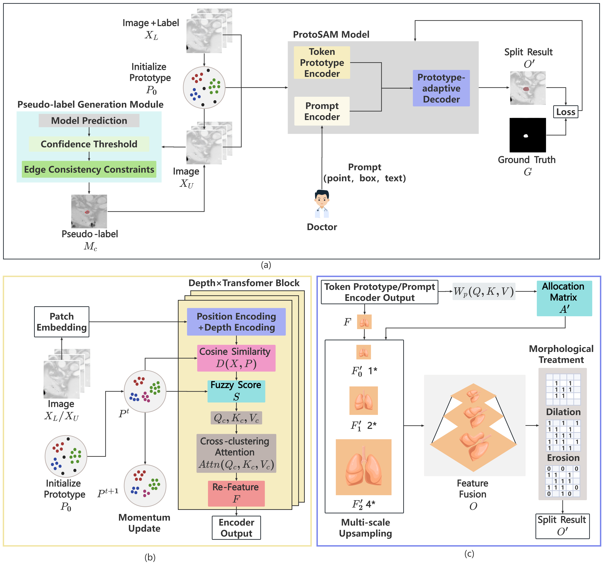

# ProtoSAM: Semi‑Supervised Prototypical Guidance for 3D Medical Image Segmentation with SAM

## Overview

> **<p align="justify"> Abstract:** *This paper proposes ProtoSAM, a novel semi-supervised model for medical image segmentation. The framework introduces a Token Prototype Encoder that integrates non-parametric prototype clustering with attention mechanisms, using fuzzy assignment and momentum-updated prototypes to enhance feature representation. Combined with Low-Rank Adaptation (LoRA), it significantly reduces fine-tuning parameters while maintaining performance. The Prototype-adaptive Decoder explicitly incorporates clustering information to guide multi-scale feature fusion and employs morphological post-processing to refine segmentation topology and boundaries. Experiments show that ProtoSAM achieves state-of-the-art performance on multiple public datasets, with significant improvements in Dice and HD95 metrics, while demonstrating strong generalization capability with limited annotations. By generating high-quality pseudo-labels through knowledge prototypes, ProtoSAM effectively reduces dependency on fully annotated data, offering a practical solution for medical image segmentation.* </p>

## Method



## Segmentation Results


## Installation 
* Setup conda environment (recommended).
```bash
# Install conda pack
pip install conda-pack

# Download environment compressed file
Protosam.tar.gz https://huggingface.co/datasets/fish111111/ProtoSAM/tree/main

# Unzip and activate the environment
mkdir /home/.conda/envs/Protosam
tar -xzf Protosam.tar.gz -C /home/.conda/envs/Protosam
conda activate Protosam
```

## Data preparation

* Download the dataset [here](https://huggingface.co/datasets/fish111111/ProtoSAM/tree/main).

* Place dataset under `datafile` like the following:
```
datafile/
|–– lung/
|   |–– imagesTr/
|   |–– labelsTr/
|   |–– split.pkl/
|–– lung2/
|   |–– imagesTr/
|   |–– labelsTr/
|   |–– split.pkl/
...
```

## Training and Evaluation
* Run the training and evaluation script

```bash
bash train_iseg_tri_attn_loraAdapter_pEncodeS_miniD.sh

bash _similative_click.sh
```
* You can change some design settings in the [train](https://github.com/yuzhiming21/ProtoSAM/blob/main/train_iseg_tri_attn_loraAdapter_pEncodeS_miniD.sh) and [test](https://github.com/yuzhiming21/ProtoSAM/blob/main/_similative_click.sh).

## Citation
If you use our work, please consider citing:


## Acknowledgements

Our code builds upon the [sam](https://github.com/facebookresearch/segment-anything), [Fastsam3d](https://github.com/arcadelab/FastSAM3D) repositories. We are grateful to the authors for making their code publicly available. If you use our model or code, we kindly request that you also consider citing these foundational works.
